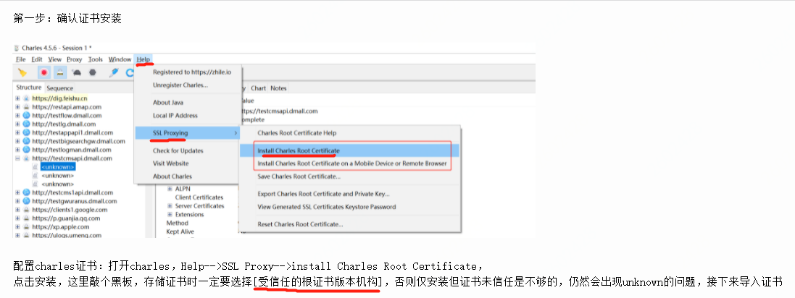
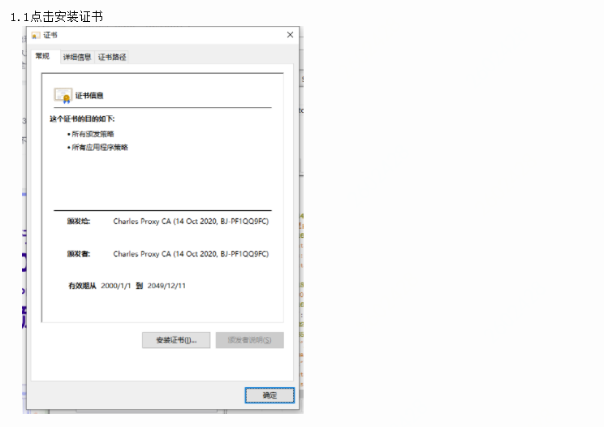
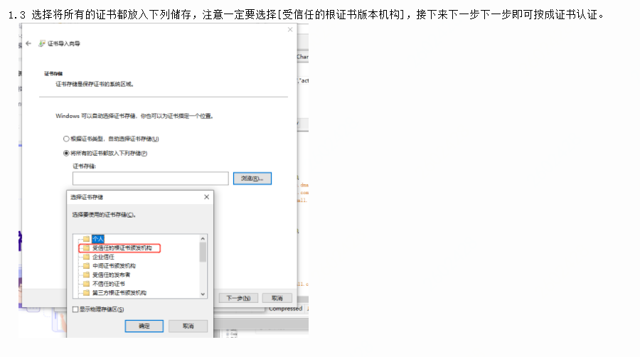
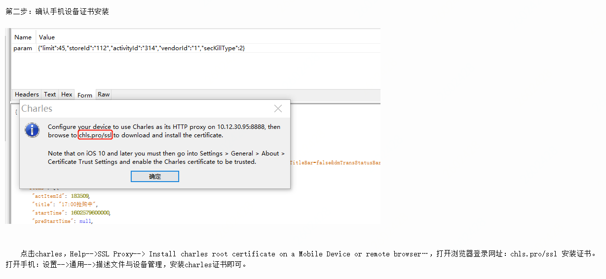
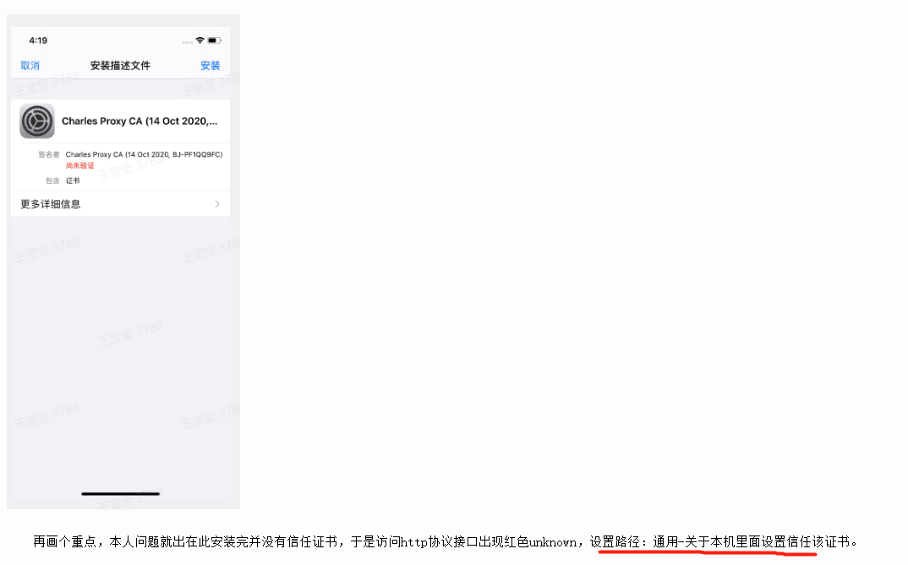
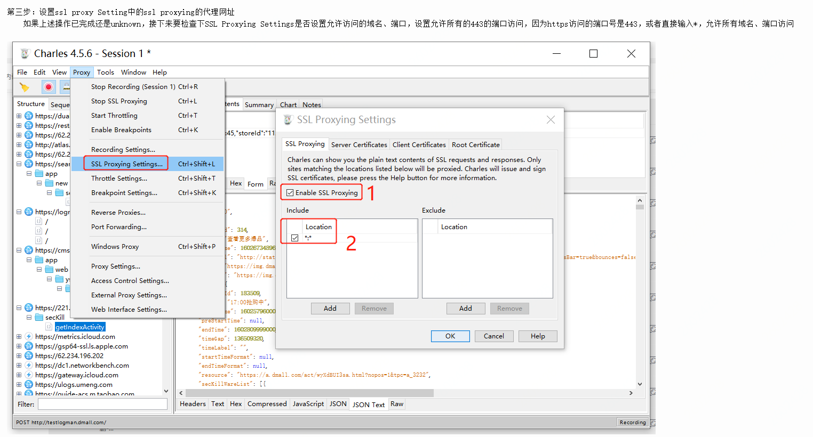
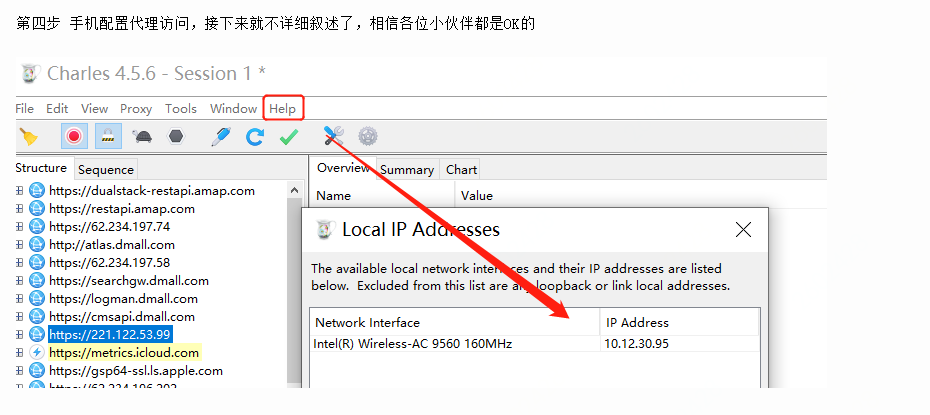
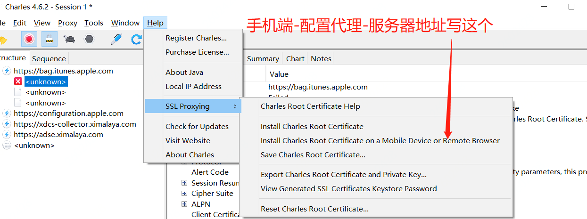
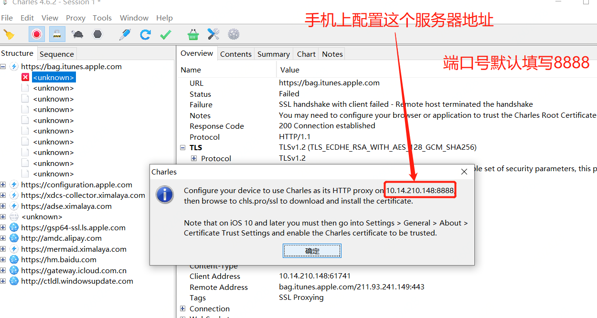

- 以windows10-64位为例
- windows10安装charles，安装包在阿里云盘 ，已破解：[下载地址](https://www.aliyundrive.com/s/f8TFXetkDJS)
- [参考地址](https://www.cnblogs.com/dy99/p/13817055.html)
- 安装证书-电脑: 

- 安装证书-手机: 

- 手机设置-iPhone11为例
  -- 手机连笔记本wifi
  -- 手机通过wifi网路名称后面图标点击进入，配置代理，改为手动
  -- 服务器地址（端口号默认8888）：
    
    

